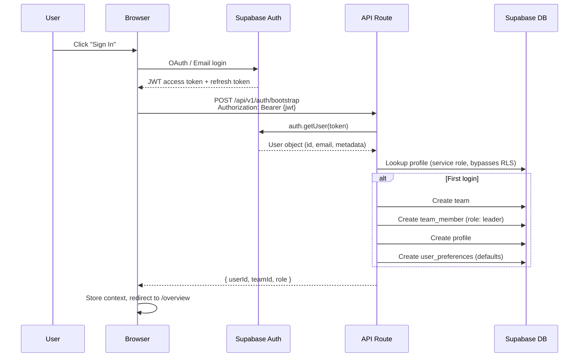
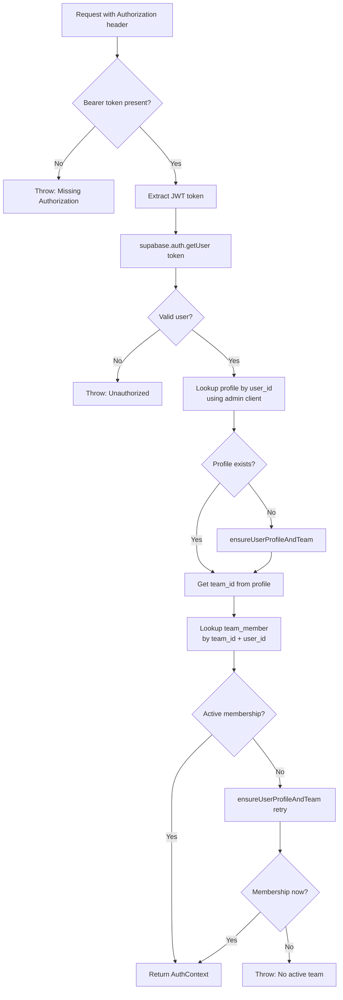
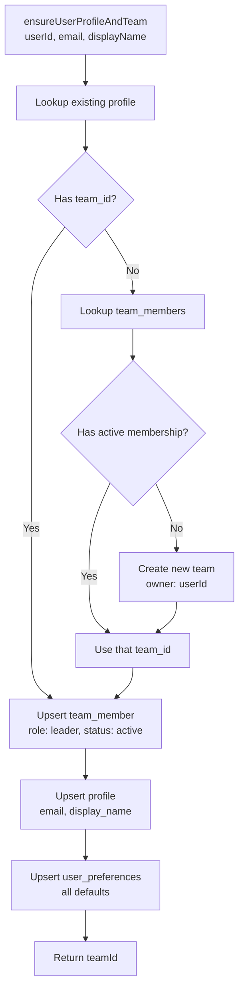

# Authentication & Authorization

## Overview

Authentication is JWT-based via Supabase Auth. Authorization is enforced at two levels:
1. **Application level** - `verifyAuth()` in API routes extracts and validates user context
2. **Database level** - Row-Level Security (RLS) policies on every table scope data to `team_id`

## Auth Flow



## Supabase Clients

Two distinct clients exist for different trust levels:

### Admin Client (`getSupabaseAdmin()`)
- **Key:** `SUPABASE_SERVICE_ROLE_KEY`
- **RLS:** Bypassed (full access)
- **Use:** Bootstrap operations, cross-user queries, profile completeness updates
- **Location:** `lib/auth.server.ts:28`
- **Caching:** Singleton - created once per process lifetime

```typescript
// Bypasses RLS - use only in trusted server contexts
const supabaseAdmin = getSupabaseAdmin()
```

### User-Scoped Client (`createUserSupabaseClient(token)`)
- **Key:** `NEXT_PUBLIC_SUPABASE_ANON_KEY` + user's JWT
- **RLS:** Enforced (user sees only their team's data)
- **Use:** User-initiated data operations
- **Location:** `lib/auth.server.ts:45`

```typescript
// RLS-scoped to the user's team
const supabase = createUserSupabaseClient(accessToken)
```

## verifyAuth()

The core auth function called at the top of every authenticated API route.

**Location:** `lib/auth.server.ts:175`

**Returns:** `AuthContext { userId: string, teamId: string, role: "leader" | "member" }`



**Key behavior:**
- Self-healing: If profile or membership is missing, it auto-creates via `ensureUserProfileAndTeam()`
- Service role client used for lookups (bypasses RLS)
- User ID comes from the verified JWT, not from the request body (tamper-proof)

## ensureUserProfileAndTeam()

Auto-bootstrap function for first-time users. Creates the full account structure.

**Location:** `lib/auth.server.ts:67`

**Creates (in order):**
1. **Team** - Named `"{displayName} Team"` (if no existing team membership found)
2. **Team member** - Links user to team with `role: "leader"`, `status: "active"`
3. **Profile** - With email, display_name, `updated_at`
4. **User preferences** - With all defaults (USD, tightness=3, platforms=[upwork, linkedin])

**Idempotent:** Uses `upsert` with `onConflict` for all writes. Safe to call multiple times.



## Row-Level Security (RLS)

Every table in the `public` schema has RLS enabled. Policies ensure:

| Rule | Effect |
|------|--------|
| All reads scoped by `team_id` | Users can only see their team's data |
| All writes scoped by `team_id` | Users can only modify their team's data |
| Service role bypasses RLS | Server-side admin operations work unrestricted |

**Invariant:** Every authenticated request resolves to a `(userId, teamId, role)` tuple. All subsequent queries use `team_id` for scoping.

## AuthContext Type

```typescript
type AuthContext = {
  userId: string   // Supabase auth user UUID
  teamId: string   // Team UUID (tenant isolation key)
  role: "leader" | "member"  // Team role
}
```

Used throughout the codebase as the standard auth payload. Passed to:
- Database query functions
- Agent context builders
- Profile completeness computation
- All API route handlers

## Security Considerations

1. **No middleware.ts** - Auth validation happens inside each API route handler via `verifyAuth()`. This is intentional - different routes may need different auth strategies in the future.
2. **Server-only imports** - `auth.server.ts` uses `import "server-only"` to prevent accidental client bundling of the service role key.
3. **Cached admin client** - The service role client is a singleton. This is safe because it's stateless (no user context attached).
4. **JWT expiry** - Handled by Supabase Auth client on the browser side. Refresh tokens auto-renew the access token.
5. **No secrets in client** - Only `NEXT_PUBLIC_*` vars reach the browser. Service role key stays server-side.
