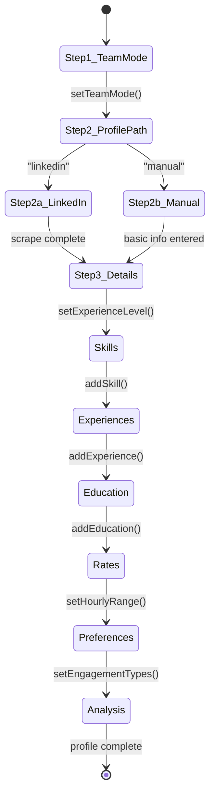
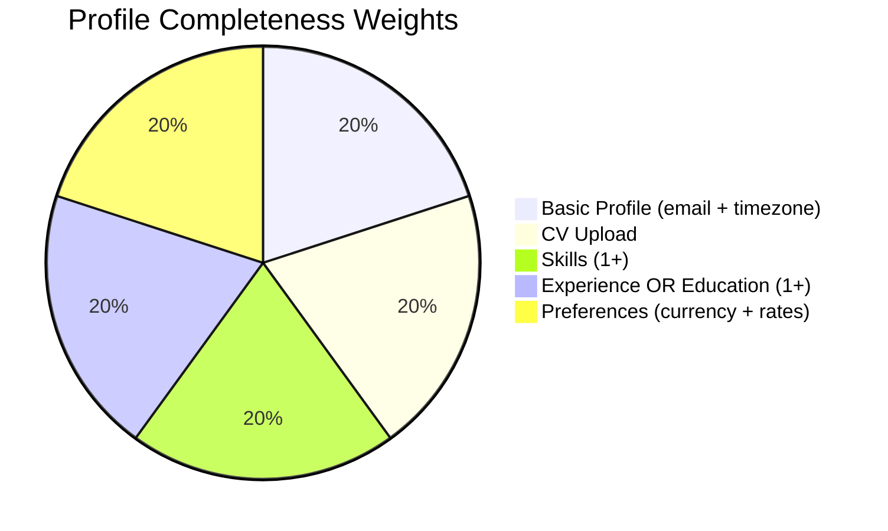

# Frontend Architecture

## Design System

### Color Palette

Uses OKLCH color space (perceptually uniform) for consistent contrast across light/dark modes.

| Token | Light | Dark | Usage |
|-------|-------|------|-------|
| `--primary` | `oklch(0.62 0.14 39)` warm amber | `oklch(0.59 0.12 136)` muted green | CTAs, links, active states |
| `--background` | `oklch(0.98 0.005 95)` warm off-white | `oklch(0.27 0.004 107)` dark charcoal | Page background |
| `--card` | Same as background | Same as background | Card surfaces |
| `--muted` | `oklch(0.93 0.015 90)` soft tan | `oklch(0.22 0.004 107)` dark surface | Secondary backgrounds |
| `--border` | `oklch(0.88 0.007 97)` subtle | `oklch(0.36 0.01 107)` subtle | Dividers, outlines |
| `--destructive` | Dark variant | Red `oklch(0.64 0.21 25)` | Errors, danger |

### Design Language: Glass Morphism

```css
/* Core glass effect - used throughout the app */
.glass-card {
  background: oklch(from var(--card) l c h / 0.8);
  backdrop-filter: blur(4px);
  border: 1px solid oklch(from var(--border) l c h / 0.5);
}
```

Additional utility classes:
- `.glow-primary` - Subtle primary-colored box shadow
- `.hover-lift` - Translate Y -2px on hover with shadow
- `.animated-gradient` - Animated text gradient (green tones)
- `.shimmer-text` - Loading shimmer effect for text
- `.shimmer-overlay` - Loading shimmer for surfaces
- `.scrollbar-thin` - Custom thin scrollbar styling

### Typography

System font stack (no custom fonts loaded):
- Sans: `ui-sans-serif, system-ui, ...`
- Mono: `ui-monospace, SFMono-Regular, Menlo, ...`
- Serif: `ui-serif, Georgia, ...`

### Spacing

Base spacing unit: `--spacing: 0.276rem` (Tailwind CSS 4 custom spacing)

### Border Radius

Base radius: `--radius: 0.99rem` (~16px). Derived:
- `--radius-sm`: `calc(var(--radius) - 4px)` (~12px)
- `--radius-md`: `calc(var(--radius) - 2px)` (~14px)
- `--radius-lg`: `var(--radius)` (~16px)
- `--radius-xl`: `calc(var(--radius) + 4px)` (~20px)

### Dark Mode

Implemented via `next-themes` with `ThemeProvider`. Toggle component in header. The `.dark` class on `<html>` triggers CSS custom property overrides.

## Component Library

### shadcn/ui Components (40+)

Standard shadcn/ui components with Radix UI primitives:

```
ui/
  accordion, alert, avatar, badge, button, calendar, card, chart,
  checkbox, collapsible, dialog, drawer, dropdown-menu, form, input,
  label, menubar, navigation-menu, popover, progress, radio-group,
  scroll-area, select, separator, sheet, sidebar, skeleton, slider,
  sonner (toasts), switch, table, tabs, textarea, toggle, toggle-group,
  tooltip
```

### Custom Components

#### AI Components (`components/ai/`)

**chain-of-thought.tsx** - Renders OpenAI extended reasoning as a collapsible panel with duration indicator. Shows the AI's "thinking" process during profile analysis.

**tool.tsx** - Renders agent tool calls inline in the conversation. Shows tool name, parameters, execution status, and elapsed time. Used to display LinkedIn scraping progress.

#### AI Elements (`components/ai-elements/`)

**conversation.tsx** - Full conversation container with auto-scroll, message rendering, and streaming support.

**message.tsx** - Individual message bubble. Handles:
- User vs assistant styling
- Markdown rendering (`.prose` / `.prose-sm` classes)
- Tool call embedding
- Edit affordance (pencil icon for user messages)

**prompt-input.tsx** - Text input with submit button, quick reply chips, and focus mode support.

#### Onboarding

**onboarding-chatbot.tsx** (~1350 lines) - The main onboarding experience. Orchestrates:
- SSE connection to `/api/v1/onboarding/chat`
- Message history management
- Streaming response rendering
- Tool call visualization (LinkedIn scraping with elapsed time)
- Profile analysis with chain-of-thought
- Quick reply suggestions
- Message editing and conversation replay
- Focus mode (blurs background, elevates input)
- Progress persistence to API

**onboarding-completeness-reminder.tsx** - Banner shown when profile < 80% complete.

#### Score Components

**score-indicator.tsx** - Profile analysis results display:
- Overall score gauge (radial SVG)
- Category breakdown cards
- Strengths / improvements lists

**reasoning.tsx** - Extended reasoning visualization:
- Streaming thought display
- Expandable / collapsible
- Duration tracking
- Shimmer animation while thinking

#### Layout Components

- **app-sidebar.tsx** - Navigation sidebar with section links
- **site-header.tsx** - Top bar with theme toggle, user menu
- **settings-dialog.tsx** / **settings-panel.tsx** - User preference editing
- **login-form.tsx** - Supabase Auth UI wrapper
- **data-table.tsx** - TanStack Table wrapper for job listings

### Interview Prep CSS

Specialized CSS for the voice interview UI:

| Class | Purpose |
|-------|---------|
| `.interview-orb` | 200px circular container |
| `.interview-orb-connecting` | Breathing animation + primary glow |
| `.interview-orb-speaking` | Pulsing animation + strong glow |
| `.interview-orb-listening` | Subtle pulse + green glow |
| `.interview-orb-analyzing` | Breathing animation |
| `.interview-pulse-ring-{1,2,3}` | Expanding ring animations around orb |

### Prose Styles

Full markdown rendering support via `.prose` and `.prose-invert` classes. Includes:
- Headings (h1-h6), paragraphs, bold, italic, strikethrough
- Links, lists (ordered, unordered, task lists)
- Code blocks, inline code, blockquotes
- Tables (GFM), horizontal rules, images
- Footnotes, abbreviations, keyboard input, mark/highlight
- Size variants: `.prose-sm` (0.875rem), `.prose-xs` (0.75rem, used in reasoning)

## State Management

### Redux Toolkit

**Store:** `lib/state/store.ts`

**Onboarding Slice** (`lib/state/onboardingSlice.ts`):



**Key state shape:**
```typescript
{
  currentStep: number         // 1-3
  teamMode: "solo" | "team"
  profilePath: "linkedin" | "manual" | ...
  experienceLevel: "intern_new_grad" | "entry" | "mid" | "senior" | "lead" | "director"
  profile: { firstName, lastName, dateOfBirth }
  cv: { storagePath, filename, uploadProgress, isUploading, error }
  skills: [{ id, name, level, years }]
  experiences: [{ id, title, company, startDate, endDate, highlights }]
  educations: [{ id, school, degree, field, startYear, endYear }]
  preferences: {
    platforms, currency, hourlyMin/Max, fixedBudgetMin,
    projectTypes, timeZones, remoteOnly, engagementTypes, tightness
  }
  completion: { score, missingFields }
  isSaving, saveError
}
```

40+ action creators for granular state updates.

## Custom Hooks

| Hook | File | Purpose |
|------|------|---------|
| `useMobile()` | `hooks/use-mobile.ts` | Returns `true` when viewport < 768px. Uses `matchMedia` listener. |
| `useUserPlan()` | `hooks/use-user-plan.ts` | Fetches and caches user's subscription plan tier. |
| `useUtm()` | `hooks/use-utm.ts` | Extracts UTM parameters from URL for marketing attribution. |
| `useFocusMode()` | `hooks/use-focus-mode.ts` | Toggle state for onboarding focus mode (blurs background). |
| `useLinkedinPopup()` | `hooks/use-linkedin-popup.ts` | Manages LinkedIn OAuth popup window lifecycle. |

## Profile Completeness Algorithm

**Location:** `lib/profile-completeness.server.ts`

Computed server-side, never trusted from the client. Five equally-weighted categories:



**Threshold:** Score >= 0.8 (80%) required to access `/overview`. Users below this are redirected to the onboarding chatbot.

**Detailed criteria:**
| Category | Weight | Passes when |
|----------|--------|------------|
| Basic profile | 0.20 | `email` AND `timezone` are set |
| CV files | 0.20 | At least 1 `user_cv_files` record |
| Skills | 0.20 | At least 1 `user_skills` record |
| Experience/Education | 0.20 | At least 1 `user_experiences` OR 1 `user_educations` |
| Preferences | 0.20 | `currency` set AND (`hourly_min` or `hourly_max`) AND (`current_hourly_min` or `current_hourly_max`) |
