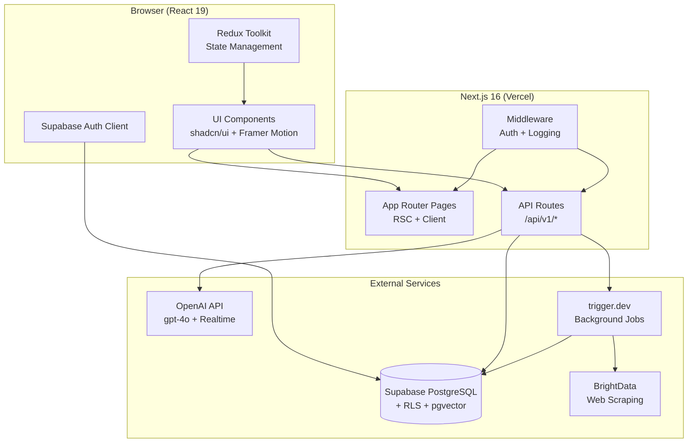
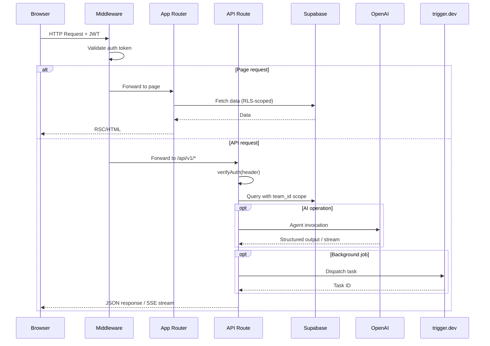
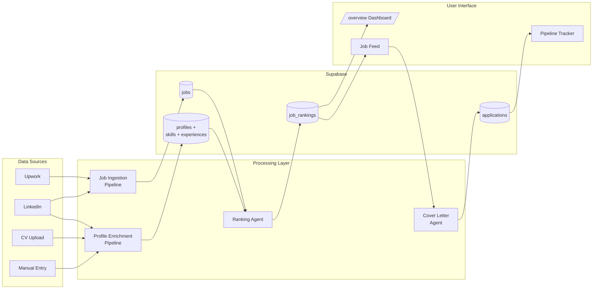

# System Architecture

## Sub-documents

- [[architecture/auth]] - Authentication flow, JWT verification, RLS, bootstrap
- [[architecture/api-reference]] - All API routes with request/response shapes
- [[architecture/frontend]] - Design system, component library, hooks, state management
- [[architecture/infrastructure]] - Build system, deployment, env config, trigger.dev

## High-Level System Diagram



## Monorepo Layout

```
hiremeplz-v1/
  apps/
    web/                    # Next.js 16 - frontend + API routes
    docs/                   # This spec (Obsidian vault)
  packages/
    db/                     # Raw Postgres utilities (pg client)
    trigger/                # trigger.dev workflow definitions
    ui/                     # Shared React component library (button, card, code)
    eslint-config/          # Shared ESLint config
    typescript-config/      # Shared TypeScript config
  supabase/
    migrations/             # SQL migration files (3 migrations)
```

**Build system:** Turborepo with pnpm 10.x workspaces.

## Tech Stack

| Layer | Technology | Notes |
|-------|-----------|-------|
| Frontend | Next.js 16, React 19, TypeScript | App Router, RSC where possible |
| Styling | Tailwind CSS 4, shadcn/ui, Radix UI | Glass morphism design language |
| Animation | Framer Motion | Conversation UI, transitions |
| State | Redux Toolkit | Onboarding slice, future: pipeline slice |
| Tables | TanStack Table | Job listings, application tracking |
| Database | Supabase PostgreSQL | RLS enabled on all tables |
| Auth | Supabase Auth (JWT) | Server-side verification via `lib/auth.server.ts` |
| AI Agents | OpenAI Agents SDK (`@openai/agents`) | gpt-4o, structured outputs, streaming |
| AI Realtime | OpenAI Realtime API | Voice interview practice |
| Background Jobs | trigger.dev | LinkedIn scraping, future: scheduled monitors |
| Scraping | BrightData datasets, Apify | LinkedIn profiles, job listings |
| Embeddings | pgvector extension | Prepared, not yet active |
| Hosting | Vercel (web), Supabase (db) | Edge functions for future use |

## Request Lifecycle



## Data Flow Overview



## Key Directories (apps/web)

```
src/
  app/
    (marketing)/          # Landing page, public routes
    (app)/                # Authenticated app shell
      overview/           # Main dashboard (agent hub)
      interview-practice/ # Voice interview prep
      settings/           # User preferences
    api/v1/               # See [[architecture/api-reference]]
      auth/bootstrap/     # First-login team/profile creation
      me/                 # Profile CRUD
      onboarding/         # Chat SSE + progress persistence
      interview-prep/     # Token, session, analysis
      teams/              # Team management
      settings/           # Preference endpoints
      health/             # Health check
      jobs/               # [suspended] Job APIs
      test/               # Dev-only test endpoints
  components/             # See [[architecture/frontend]]
    ai/                   # Chain-of-thought, tool call display
    ai-elements/          # Conversation primitives
    onboarding/           # Onboarding-specific UI
    ui/                   # shadcn/ui components (40+)
  lib/
    agents/               # Agent definitions (interview, analysis)
    state/                # Redux store + slices
    auth.server.ts        # See [[architecture/auth]]
    supabaseClient.ts     # Supabase browser client
    profile-completeness.server.ts
    linkedin-scraper.server.ts
  config/
    site.ts               # App metadata
  hooks/                  # See [[architecture/frontend#hooks]]
```

## Conventions

- **Quotes:** Double quotes everywhere
- **Semicolons:** Omitted
- **Exports:** Named exports preferred
- **Components:** Follow shadcn/ui patterns (`cn()` utility, `cva` variants, `data-*` attributes)
- **Server/Client boundary:** Explicit `"use server"` / `"use client"` directives
- **Functions:** Small, pure, well-typed. Avoid over-engineering.
- **File naming:** `kebab-case.ts` for utilities, `kebab-case.tsx` for components
- **Server-only imports:** Use `import "server-only"` to prevent accidental client bundling of secrets
