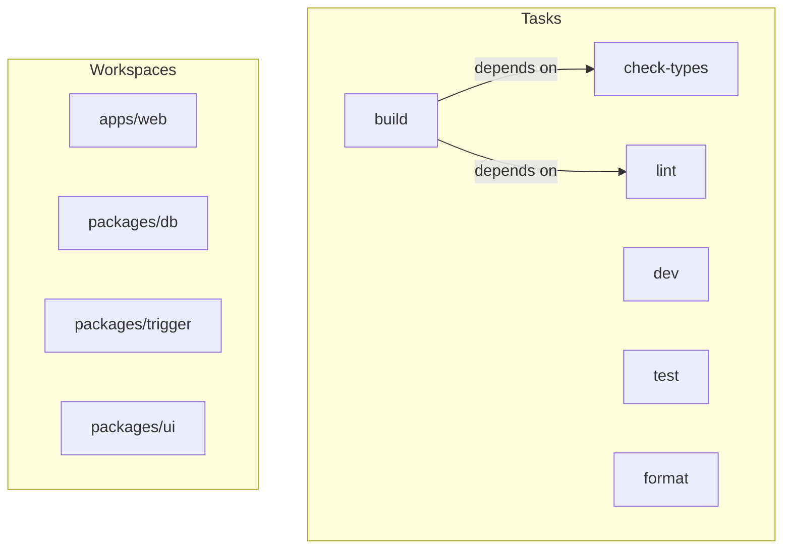
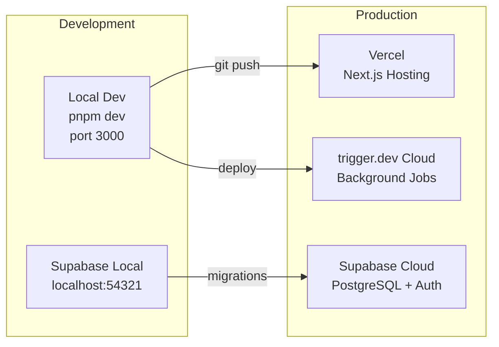

# Infrastructure & DevOps

## Build System

### Turborepo

**Config:** `turbo.json`



**Key settings:**
- TUI mode enabled (interactive terminal UI for dev)
- Task dependencies: `build` depends on `^build` (builds packages first)
- Environment variable passthrough configured in `turbo.json`

### pnpm Workspaces

**Version:** pnpm 10.26.0
**Node:** >=18

**Workspace structure:**
```
pnpm-workspace.yaml
  - apps/*
  - packages/*
```

**Common commands:**
```bash
pnpm dev                               # Start all dev servers (Turbo TUI)
cd apps/web && pnpm dev                # Web app only (port 3000)
pnpm build                             # Build all workspaces
pnpm check-types                       # TypeScript type checking
pnpm lint                              # ESLint (flat config)
pnpm format                            # Prettier (ts, tsx, md)
pnpm test                              # Vitest (all packages)
pnpm turbo run test --filter db        # Package-specific test
```

## Packages

### packages/db
PostgreSQL utilities using raw `pg` client.

**Exports:**
- `withPgTransaction()` - Transaction wrapper
- `writeJobSearchBatch()` - Batch job insert
- pg-mem fallback for lightweight testing

**Testing:** Vitest with integration tests against Postgres.

### packages/trigger
trigger.dev workflow definitions.

**Files:**
- `example.ts` - Template task
- `linkedin-profile-scraper.ts` - LinkedIn scraping workflow (545 lines)

**LinkedIn scraper details:**
- BrightData dataset: `gd_l1viktl72bvl7bjuj0`
- Polling: 60 attempts, 5s intervals, 5min max
- Retry: 3 attempts, exponential backoff
- Max duration: 10 minutes
- Outputs: `DistilledProfile` with identity, skills, experiences, education, experience level inference

### packages/ui
Shared React component library.

**Components:** `button.tsx`, `card.tsx`, `code.tsx`

Lightweight - most UI components live in `apps/web/src/components/ui/` following shadcn/ui's copy-paste model.

## Database Migrations

**Location:** `supabase/migrations/`

| Version | Name | Description |
|---------|------|-------------|
| `20260114120000` | `canonical_schema` | Full initial schema (all tables, RLS, extensions, stored procedures) |
| `20260117150000` | `jobs_company_logo` | Add `company_logo_url` to jobs |
| `20260117163000` | `job_rankings_latest` | Rankings table updates |

**Extensions enabled:**
- `pgcrypto` - UUID generation (`gen_random_uuid()`)
- `vector` - pgvector for embeddings (prepared, not yet populated)

**Stored procedures:**
- `upsert_jobs_and_rankings()` - Batch upsert for [[pipelines/job-ingestion]]

## Environment Variables

### Required

| Variable | Scope | Purpose |
|----------|-------|---------|
| `NEXT_PUBLIC_SUPABASE_URL` | Public | Supabase project URL |
| `NEXT_PUBLIC_SUPABASE_ANON_KEY` | Public | Supabase anonymous/publishable key |
| `SUPABASE_SERVICE_ROLE_KEY` | Server | Admin access (bypasses RLS) |
| `SUPABASE_JWT_SECRET` | Server | JWT verification |
| `OPENAI_API_KEY` | Server | AI agent operations |
| `TRIGGER_SECRET_KEY` | Server | trigger.dev authentication |
| `BRIGHTDATA_API_KEY` | Server | LinkedIn/job scraping |
| `DATABASE_URL` | Server | Direct Postgres connection string |
| `NEXT_PUBLIC_APP_URL` | Public | Canonical app URL |

### Optional / Dev-only

| Variable | Scope | Purpose |
|----------|-------|---------|
| `TRIGGER_API_KEY` | Server | trigger.dev API key (alternative auth) |
| `JOB_SEARCH_SCRAPE_MAX_JOBS` | Server | Cap total jobs per search run (default: 100) |
| `JOB_SEARCH_SCRAPE_MAX_JOBS_PER_QUERY` | Server | Cap jobs per individual query (default: 50) |
| `BRIGHTDATA_LINKEDIN_JOBS_DISCOVER_DATASET_ID` | Server | BrightData dataset for LinkedIn job discovery |
| `BRIGHTDATA_LINKEDIN_JOBS_DETAILS_DATASET_ID` | Server | BrightData dataset for LinkedIn job details (`gd_lpfll7v5hcqtkxl6l`) |
| `TEST_USER_ID` | Server | Test user UUID for dev endpoints |
| `TEST_TEAM_ID` | Server | Test team UUID for dev endpoints |
| `NEXT_PUBLIC_HIREMEPLZ_SITE_MODE` | Public | Lockdown mode for dev/staging |

## Deployment



### Vercel
- Auto-deploys from git push
- Environment variables configured in Vercel dashboard
- Edge runtime available but not yet used

### Supabase
- Migrations applied via Supabase CLI or dashboard
- RLS policies defined in migration SQL
- Storage buckets for CV files

### trigger.dev
- Tasks deployed from `packages/trigger/`
- Runs in cloud worker environment
- Retry and backoff configured per task

## Cost Considerations

| Service | Cost driver | Mitigation |
|---------|------------|------------|
| OpenAI | Token usage (gpt-4o) | Structured outputs reduce token waste; cache agent contexts |
| BrightData | Dataset queries | Rate limit per user; batch queries; cache results |
| Supabase | Database size, API calls | RLS reduces over-fetching; batch upserts |
| Vercel | Serverless invocations, bandwidth | SSR caching; ISR for marketing pages |
| trigger.dev | Task executions | Dedup before dispatching; configurable intervals |
