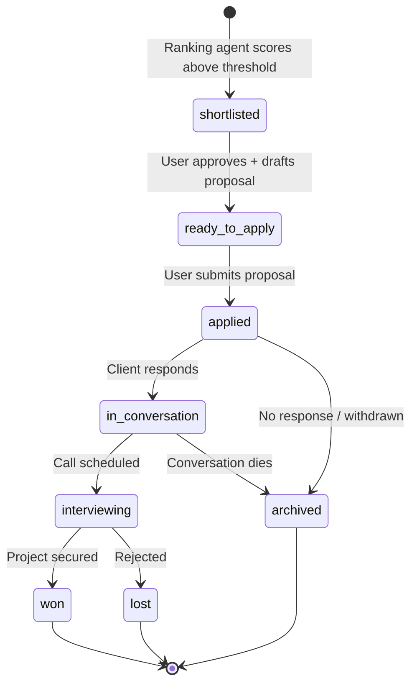

# Data Model

All tables live in the `public` schema on Supabase PostgreSQL. RLS is enabled on every table. Every user-facing table is scoped by `team_id`.

## Entity Relationship Diagram

```mermaid
erDiagram
  teams ||--o{ team_members : "has members"
  teams ||--o{ profiles : "has profiles"
  teams ||--o{ jobs : "owns jobs"
  teams ||--o{ agent_runs : "runs agents"
  teams ||--o{ interview_sessions : "has sessions"
  teams ||--o{ events : "logs events"
  teams ||--o{ notifications : "sends notifications"
  teams ||--o{ usage_counters : "tracks usage"
  teams ||--|| team_settings : "has settings"

  profiles ||--o{ user_skills : "has skills"
  profiles ||--o{ user_experiences : "has experiences"
  profiles ||--o{ user_educations : "has education"
  profiles ||--o{ user_cv_files : "has CVs"
  profiles ||--|| user_preferences : "has preferences"
  profiles ||--o{ user_profile_snapshots : "has snapshots"
  profiles ||--o{ user_agent_settings : "has agent config"

  jobs ||--o{ job_sources : "raw data"
  jobs ||--o{ job_rankings : "AI scores"
  jobs ||--o{ applications : "applied to"
  jobs ||--o{ cover_letters : "proposals for"
  jobs ||--o{ apply_sessions : "apply flows"

  applications ||--o{ feedback : "client responses"
  messages ||--o{ feedback : "linked messages"

  agent_runs ||--o{ agent_run_steps : "has steps"
  agent_runs ||--o{ job_rankings : "produced by"

  teams ||--o{ earnings : "revenue"
  teams ||--o{ messages : "communications"
  teams ||--o{ embeddings : "vectors"
```



## Entity Tree (text)

```
teams
  |-- team_members (user_id, role)
  |-- profiles (user_id, plan, completeness_score)
  |     |-- user_skills
  |     |-- user_experiences
  |     |-- user_educations
  |     |-- user_cv_files
  |     |-- user_preferences (platforms, rates, tightness)
  |     |-- user_profile_snapshots (LinkedIn raw data)
  |     |-- user_agent_settings (per-agent config, onboarding state)
  |
  |-- jobs (platform, title, budget, client info, skills)
  |     |-- job_sources (raw platform data)
  |     |-- job_rankings (agent_run_id, score, breakdown)
  |     |-- applications (status pipeline)
  |     |     |-- feedback (client responses)
  |     |-- cover_letters (style, temperature, content)
  |     |-- apply_sessions (token-gated apply flow)
  |
  |-- agent_runs (type, trigger, status, inputs/outputs)
  |     |-- agent_run_steps (step_name, status, meta)
  |
  |-- interview_sessions (type, transcript, metrics, analysis)
  |-- messages (platform, direction, thread)
  |-- earnings (amount, currency, occurred_at)
  |-- embeddings (entity_type, entity_id, vector)
  |-- events (event_type, payload) -- audit log
  |-- notifications (type, payload, read_at)
  |-- usage_counters (day, metric, count)
  |-- team_settings (settings_json)
```

## Table Count (current production data)

| Table | Rows | Notes |
|-------|------|-------|
| teams | 8 | |
| team_members | 13 | |
| profiles | 8 | |
| jobs | 3,161 | From early scraping experiments |
| job_rankings | 3 | Only test rankings |
| agent_runs | 25 | Onboarding + interview runs |
| agent_run_steps | 140 | |
| interview_sessions | 8 | |
| user_skills | 7 | |
| user_experiences | 1 | |
| user_preferences | 9 | |
| user_agent_settings | 8 | |
| applications | 0 | Not yet active |
| cover_letters | 0 | Not yet active |
| embeddings | 0 | Extension ready, not populated |

## Core Tables

### teams
The top-level tenant. Every data record belongs to a team. Currently 1:1 with users (single-user model), but designed for future multi-seat.

| Column | Type | Notes |
|--------|------|-------|
| id | uuid (PK) | Auto-generated |
| name | text | Team/user display name |
| owner_user_id | uuid | Supabase auth user |
| created_at | timestamptz | |

### profiles
The freelancer's identity. One per user per team.

| Column | Type | Notes |
|--------|------|-------|
| user_id | uuid (PK) | |
| team_id | uuid (FK) | |
| email | text | |
| display_name | text | |
| headline | text | Professional tagline |
| about | text | Bio / summary |
| avatar_url | text | |
| location | text | |
| country_code | text | |
| linkedin_url | text | |
| timezone | text | Default: UTC |
| team_mode | text | `solo` or `team` |
| plan | text | `trial`, future: `pro`, `team` |
| plan_ends_at | timestamptz | |
| profile_completeness_score | numeric | 0-1 scale |
| onboarding_completed_at | timestamptz | Null until complete |
| date_of_birth | date | |

### user_preferences
Controls agent behavior - what to search for, how strict to filter.

| Column | Type | Notes |
|--------|------|-------|
| user_id | uuid (PK) | |
| team_id | uuid (FK) | |
| platforms | text[] | Default: `{upwork, linkedin}` |
| currency | text | Default: USD |
| current_hourly_min | numeric | What they charge now |
| current_hourly_max | numeric | |
| hourly_min | numeric | Dream/target rate min |
| hourly_max | numeric | Dream/target rate max |
| fixed_budget_min | numeric | Minimum fixed-price budget |
| project_types | text[] | Default: `{short_gig, medium_project}` |
| tightness | int | 1-5 filter strictness (3 = default) |

**Agent note:** `tightness` controls how aggressively the [[agents/ranking-agent]] filters. 1 = show everything remotely relevant, 5 = only near-perfect matches.

### jobs
Normalized job postings from any platform.

| Column | Type | Notes |
|--------|------|-------|
| id | uuid (PK) | |
| team_id | uuid (FK) | |
| platform | enum | `upwork`, `linkedin` |
| platform_job_id | text | Dedup key per platform |
| title | text | |
| description | text | Full posting text |
| apply_url | text | Direct link to apply |
| posted_at | timestamptz | |
| budget_type | text | `hourly`, `fixed`, `unknown` |
| hourly_min/max | numeric | |
| fixed_budget_min/max | numeric | |
| currency | text | |
| client_country | text | |
| client_rating | numeric | Platform rating |
| client_hires | int | Historical hire count |
| client_payment_verified | boolean | |
| skills | text[] | Required skills |
| seniority | text | |
| category | text | |
| company_name | text | |
| canonical_hash | text | **Unique per team** - dedup across sources |
| source_raw | jsonb | Original platform payload |

### job_rankings
AI-generated scores linking a job to a user's profile.

| Column | Type | Notes |
|--------|------|-------|
| id | uuid (PK) | |
| team_id | uuid (FK) | |
| job_id | uuid (FK -> jobs) | |
| agent_run_id | uuid (FK -> agent_runs) | Which run produced this |
| tightness | int | Tightness level used for scoring |
| score | numeric | 0-100 match score |
| breakdown | jsonb | Per-dimension scores (skills, budget, client, etc.) |

### applications
The freelancer's pipeline. Status-driven workflow.

| Column | Type | Notes |
|--------|------|-------|
| id | uuid (PK) | |
| team_id | uuid (FK) | |
| job_id | uuid (FK -> jobs) | |
| user_id | uuid | |
| status | enum | See pipeline below |
| notes | text | User notes |
| applied_at | timestamptz | |
| next_follow_up_at | timestamptz | Agent-managed reminder |

**Application status pipeline:**



### agent_runs / agent_run_steps
Full audit trail of every agent execution.

**agent_types:** `job_search`, `cover_letter`, `dashboard_copilot`, `upwork_profile_optimizer`, `interview_prep`, `profile_parser`, `email_ingest`

**run_status:** `queued` -> `running` -> `succeeded` | `failed` | `canceled`

Each run has N steps, each with its own status and metadata. This enables detailed observability and debugging.

### embeddings
Vector storage for semantic search (pgvector).

| Column | Type | Notes |
|--------|------|-------|
| entity_type | text | `job`, `profile`, `skill`, etc. |
| entity_id | uuid | FK to source record |
| model | text | Embedding model used |
| dims | int | Vector dimensions |
| embedding | vector | The actual embedding |
| meta | jsonb | Additional context |

**Status:** Schema exists, extension enabled, not yet populated. Will be used for semantic job matching and profile-to-job similarity.

## Stored Procedures

### upsert_jobs_and_rankings()
Batch upsert for the [[pipelines/job-ingestion]] pipeline. Handles dedup via `canonical_hash` and creates/updates rankings in a single transaction. Used by the [[agents/job-search-agent]].

## Invariants

1. Every record has a `team_id` - no orphaned data
2. RLS policies enforce team isolation at the database level
3. `canonical_hash` on `jobs` is unique per team - prevents duplicate listings
4. `agent_runs` always have a `trigger` field explaining what initiated them
5. `profile_completeness_score` is recomputed server-side, never trusted from the client
