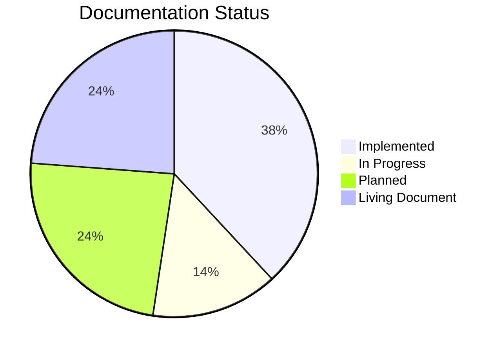

# hireMePlz - Project Spec

> A personal AI agent system that finds, evaluates, and acts on freelance opportunities so the freelancer can focus on delivery.

This is the **canonical source of truth** for what hireMePlz is, how it works, and where it's going. Written to be consumed by both AI agents (for context injection) and humans (for onboarding and decision-making).

## Map of Content

### Foundation
- [[vision]] - Why this exists, who it serves, business model
- [[data-model]] - Database schema, ERD, entity relationships, invariants
- [[glossary]] - Terminology used across the system
- [[roadmap]] - Phased delivery plan with decision log

### Architecture
- [[architecture/index]] - High-level system diagram, tech stack, data flow, monorepo layout
- [[architecture/auth]] - Authentication flow, JWT verification, RLS, bootstrap sequence
- [[architecture/api-reference]] - All API routes with request/response shapes
- [[architecture/frontend]] - Design system, component library, hooks, state management, completeness algorithm
- [[architecture/infrastructure]] - Build system, deployment, env config, packages, migrations, cost

### Agent System
- [[agents/index]] - Agent philosophy, shared patterns, chaining diagram, orchestration
- [[agents/onboarding-agent]] - Profile collection via conversational AI
- [[agents/job-search-agent]] - Source monitoring, ingestion, deduplication
- [[agents/ranking-agent]] - AI-powered match scoring with 5 dimensions
- [[agents/cover-letter-agent]] - Proposal generation tuned to freelancer voice
- [[agents/interview-prep-agent]] - Real-time voice practice with analysis
- [[agents/overview-copilot]] - Dashboard intelligence, daily briefings, nudges

### Data Pipelines
- [[pipelines/index]] - Pipeline design principles, data flow overview
- [[pipelines/job-ingestion]] - Source -> normalize -> dedupe -> store (with flow diagram)
- [[pipelines/profile-enrichment]] - LinkedIn, CV, manual -> unified profile
- [[pipelines/application-lifecycle]] - Shortlist -> apply -> track -> close (with state machine)

### Operations
- [[operations]] - Local dev setup, pre-commit checks, database ops, observability, troubleshooting, cost management

---

## Reading This Spec

**If you're an agent:** Start with [[vision]] for product context, then [[architecture/index]] for system boundaries. Load [[agents/index]] before executing any agent task. The `context_for_agents` frontmatter field in each doc tells you what's relevant to inject.

**If you're a developer:** Start with [[architecture/index]] and [[data-model]], then drill into the specific area you're working on. See [[operations]] for local setup and troubleshooting.

**Conventions:**
- `[[wikilinks]]` connect related concepts (Obsidian navigation)
- ` ```mermaid ` blocks render as diagrams in Obsidian (install Mermaid plugin if needed)
- Frontmatter `status` values: `implemented`, `in-progress`, `planned`, `speculative`
- Frontmatter `context_for_agents` provides a compressed summary for AI context injection
- Each agent doc includes a `tools` section listing available function calls
- SQL table names use `snake_case`, TypeScript uses `camelCase`

## Document Status Overview



| Status | Documents |
|--------|-----------|
| Implemented | architecture/*, auth, api-reference, frontend, infrastructure, onboarding-agent, interview-prep-agent, data-model |
| In Progress | agents/index, overview-copilot, pipelines/index |
| Planned | job-search-agent, ranking-agent, cover-letter-agent, job-ingestion, application-lifecycle |
| Living Document | vision, glossary, roadmap, operations, this index |
