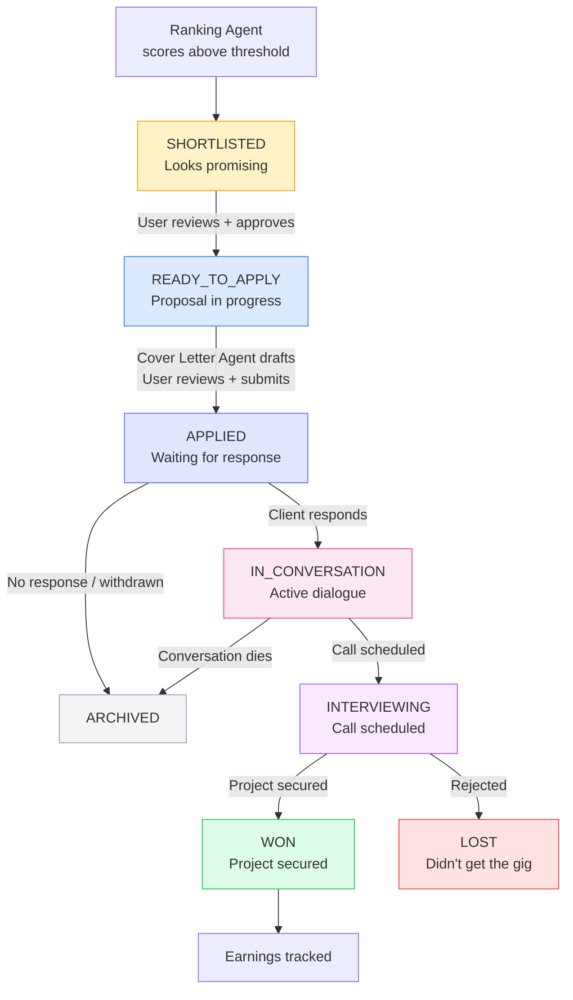

# Application Lifecycle Pipeline

Tracks freelance opportunities from first discovery through to project completion (or rejection). Acts as a lightweight CRM purpose-built for freelancers.

## Status Flow



**Text representation:**
```
shortlisted -> ready_to_apply -> applied -> in_conversation -> interviewing -> won / lost
                                         -> archived
```

## Stage Details

### SHORTLISTED
- **Created by:** [[agents/ranking-agent]] when a job scores above the user's tightness threshold
- **Visible in:** Overview action cards, job feed
- **User action:** Review match breakdown, decide to pursue or dismiss
- **Agent action:** Pre-load job details, prepare context for cover letter generation

### READY_TO_APPLY
- **Created by:** User clicks "Apply" or "Draft proposal"
- **Triggers:** [[agents/cover-letter-agent]] generates proposal draft
- **User action:** Edit proposal, attach portfolio items, submit
- **Agent action:** Draft cover letter, check platform-specific formatting

### APPLIED
- **Created by:** User confirms submission
- **Visible in:** Pipeline tracker, overview summary
- **Agent action:** Set `next_follow_up_at` to 3-5 days out, start monitoring for responses

### IN_CONVERSATION
- **Created by:** Manual status update or auto-detected message response
- **Visible in:** Active pipeline, priority action list
- **Agent action:** [[agents/overview-copilot]] tracks response timing, suggests follow-ups

### INTERVIEWING
- **Created by:** User marks interview scheduled
- **Visible in:** Calendar/action cards, interview prep suggestions
- **Agent action:** Suggest relevant [[agents/interview-prep-agent]] practice session

### WON
- **Created by:** User marks project as won
- **Triggers:** Earnings tracking, success metrics update
- **Agent action:** Log to `earnings` table, update win rate statistics, inform ranking agent for learning

### LOST
- **Created by:** User marks as lost (rejection or timeout)
- **Agent action:** Log rejection reason if provided, feed back to ranking agent for learning

### ARCHIVED
- **Created by:** User dismisses, or auto-archive after 30 days with no activity
- **Agent action:** Remove from active pipeline, keep for historical analysis

## Follow-Up Automation

The [[agents/overview-copilot]] manages follow-up timing:

| Status | Follow-up trigger | Action |
|--------|------------------|--------|
| APPLIED | No response in 3-5 days | Nudge: "Follow up on [project]?" |
| IN_CONVERSATION | No message in 2-3 days | Nudge: "Check in with [client]?" |
| INTERVIEWING | Interview date approaching | Nudge: "Practice for [project] interview" |
| READY_TO_APPLY | Draft ready > 24h, not sent | Nudge: "Your proposal for [project] is ready" |

## Analytics (Future)

Track pipeline metrics over time:
- **Conversion rates:** shortlisted -> applied -> won (funnel analysis)
- **Response rates:** % of applications that get a response, by platform
- **Time-to-response:** How quickly clients respond, by category
- **Win rate:** % of applications that result in projects
- **Average project value:** Revenue per won application
- **ROI:** Revenue attributed to hireMePlz vs. subscription cost

## Messages Table

Tracks communication threads related to applications:

| Column | Purpose |
|--------|---------|
| platform | Which platform the message came from |
| direction | `inbound` (client) or `outbound` (freelancer) |
| thread_id | Groups messages in a conversation |
| body_text | Message content |
| received_at | Timestamp |

**Future:** Email integration to auto-capture client communications and update application status.

## Earnings Table

Tracks financial outcomes:

| Column | Purpose |
|--------|---------|
| platform | Source platform |
| amount | Payment amount |
| currency | Payment currency |
| occurred_at | Payment date |
| source_json | Raw payment data |

Enables: monthly revenue tracking, platform comparison, rate trend analysis.
