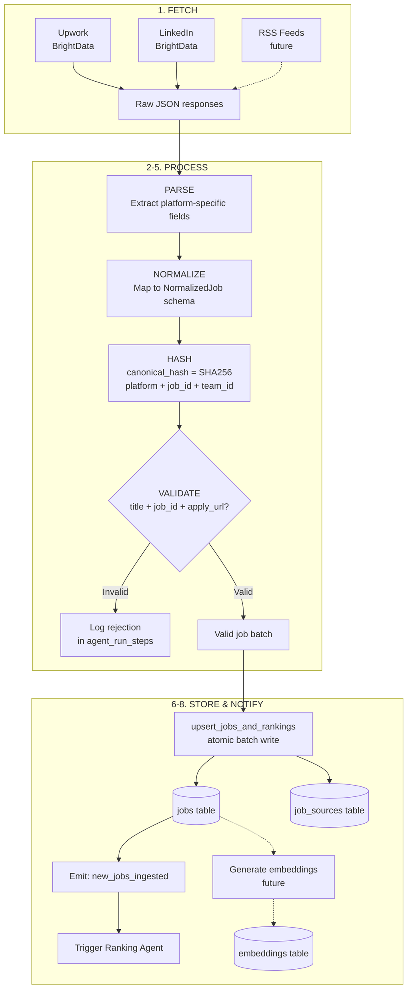

# Job Ingestion Pipeline

Converts raw job listings from heterogeneous sources into normalized, deduplicated records in the `jobs` table.

## Flow



**Steps (text):**
1. **FETCH** - Hit external API (BrightData, Apify, RSS)
2. **PARSE** - Extract fields from platform-specific JSON
3. **NORMALIZE** - Map to unified NormalizedJob schema
4. **HASH** - Generate canonical_hash for dedup
5. **VALIDATE** - Check required fields, reject malformed records
6. **STORE** - Batch upsert via `upsert_jobs_and_rankings()`
7. **INDEX** - [Future] Generate embeddings for semantic search
8. **NOTIFY** - Emit `new_jobs_ingested` event -> triggers ranking

## Step Details

### 1. Fetch

Each source has its own fetcher:

**Upwork (BrightData):**
```typescript
// BrightData dataset: gd_l1viktl72bvl7bjuj0 (reuse LinkedIn dataset pattern)
// Input: search query params built from user preferences
// Output: Array of raw job objects
// Rate limit: Respect BrightData polling intervals
```

**LinkedIn (BrightData):**
```typescript
// Similar to Upwork but different dataset ID
// Longer polling intervals (LinkedIn data refreshes slower)
```

**Future: RSS**
```typescript
// Standard RSS/Atom feed parsing
// No external API cost - just HTTP fetch + XML parse
```

### 2-3. Parse & Normalize

Platform-specific mappers:

```typescript
// Upwork raw -> NormalizedJob
function normalizeUpworkJob(raw: UpworkRawJob): NormalizedJob {
  return {
    platform: "upwork",
    platformJobId: raw.ciphertext || raw.id,
    title: raw.title,
    description: raw.description || raw.snippet,
    applyUrl: `https://www.upwork.com/jobs/${raw.ciphertext}`,
    budgetType: raw.type === "Hourly" ? "hourly" : "fixed",
    hourlyMin: raw.hourly_range?.min,
    hourlyMax: raw.hourly_range?.max,
    fixedBudgetMin: raw.budget?.min,
    fixedBudgetMax: raw.budget?.max,
    clientCountry: raw.client?.country,
    clientRating: raw.client?.rating,
    clientHires: raw.client?.total_hires,
    clientPaymentVerified: raw.client?.payment_verified,
    skills: raw.skills?.map(s => s.name) || [],
    // ...
  }
}
```

### 4. Hash

```typescript
function canonicalHash(platform: string, platformJobId: string, teamId: string): string {
  return sha256(`${platform}:${platformJobId}:${teamId}`)
}
```

### 5. Validate

Reject records missing:
- `title` (required)
- `platformJobId` (required for dedup)
- `applyUrl` (required - no point tracking a job you can't apply to)

Log rejected records in `agent_run_steps` for debugging.

### 6. Store

Use the existing `upsert_jobs_and_rankings()` stored procedure for atomic batch writes. On conflict (canonical_hash), update the existing record with fresh data.

Raw source JSON is stored in `job_sources.raw_json` for audit and reprocessing.

### 7. Index (Future)

Generate embeddings for each job description:
```typescript
{
  entity_type: "job",
  entity_id: job.id,
  model: "text-embedding-3-small",
  dims: 1536,
  embedding: await openai.embeddings.create({ input: job.title + " " + job.description })
}
```

Enables: semantic dedup, "more like this" recommendations, skill-to-job similarity.

## Error Handling

| Error | Response |
|-------|----------|
| BrightData timeout | Retry with backoff (3 attempts) |
| Rate limit (429) | Back off, reduce polling frequency |
| Malformed response | Log error, skip batch, alert |
| Partial failure | Commit successful records, log failures |
| Database error | Rollback batch, retry once, then fail run |

## Metrics

Tracked in `agent_runs.outputs`:
- `jobs_fetched` - Total records from source
- `jobs_new` - New records inserted
- `jobs_updated` - Existing records refreshed
- `jobs_skipped` - Duplicates or validation failures
- `fetch_duration_ms` - Source API latency
- `total_duration_ms` - End-to-end pipeline time
